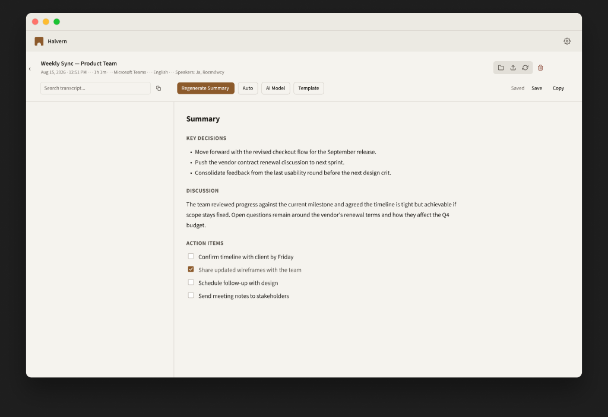
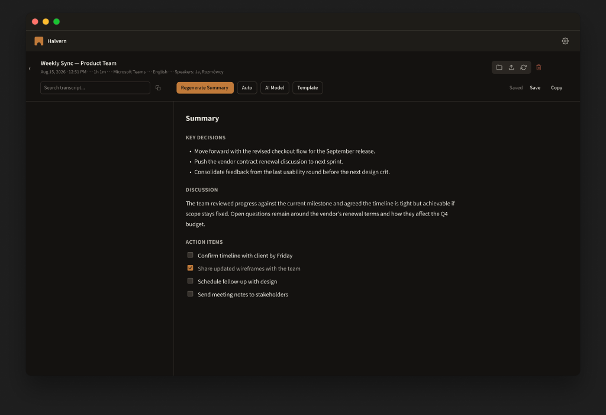
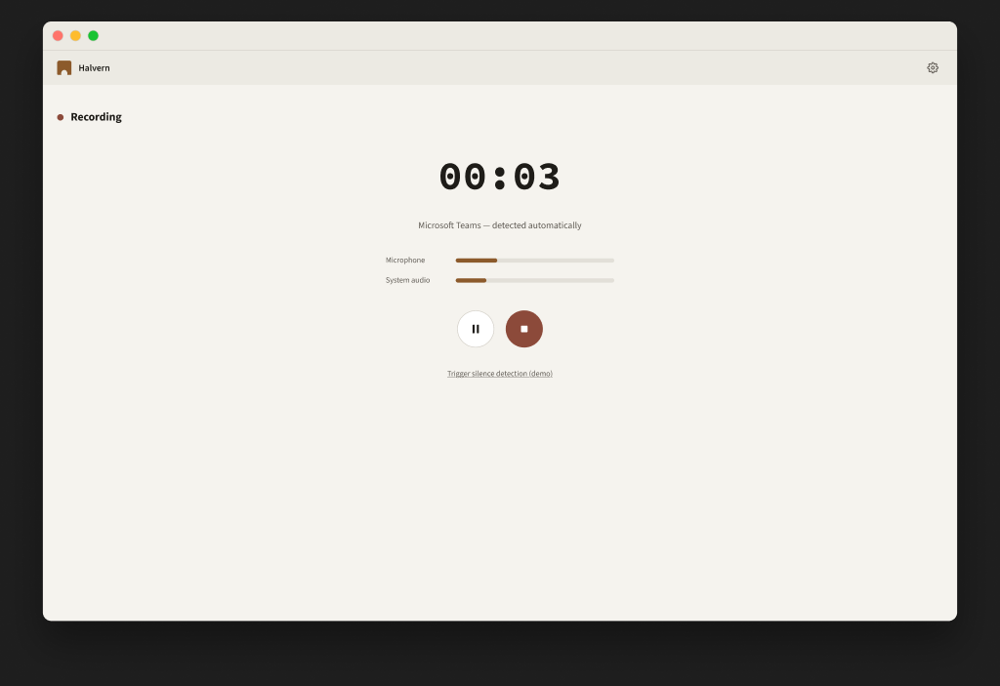
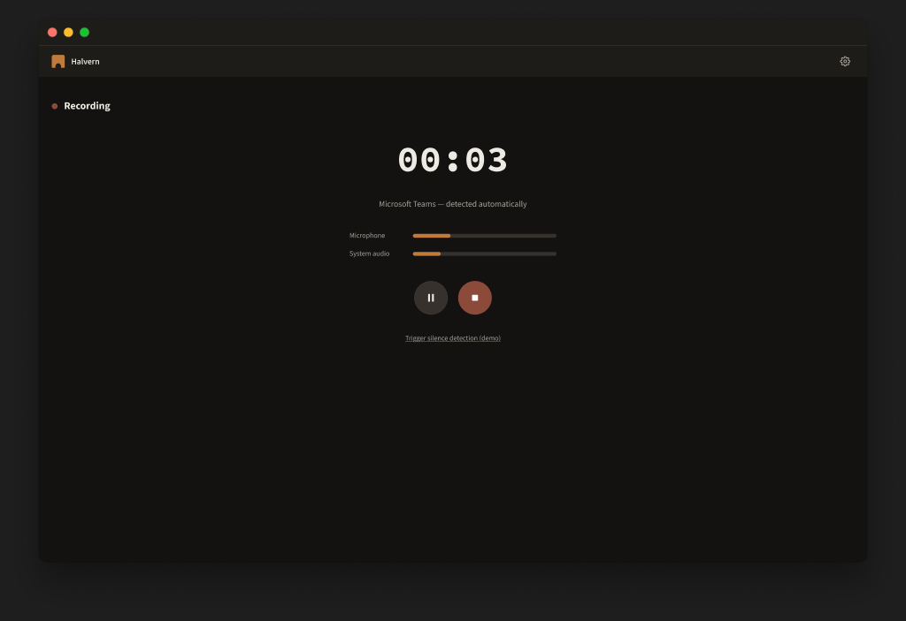

# Design rollout report

Evidence trail for the rollout specified in
the design-rollout brief (a working note, not published with the source),
executed 17 August 2026. Companion to
[DESIGN_TOKEN_MAPPING.md](DESIGN_TOKEN_MAPPING.md).

## 1. Frames delivered

| Frame | Node id | Nodes before | Nodes after | Raw-paint nodes | Foreign-font nodes |
|---|---|---|---|---|---|
| `app-library` (reference, pre-existing) | `64:178` | 1029 | 1029 | 3 | 0 |
| `app-workshop` | `69:178` | 135 (source `10:2`) | 135 | 3 | 0 |
| `app-recording` | `75:209` | 45 (source `12:2`) | 46 | 4 | 0 |

Each frame renders both themes by switching the `Semantic` collection mode;
stored mode is `Light`. No frame lost nodes. `app-recording` gained one: the
timer was rebuilt (§4.1), and its uneditable original is hidden inside the
frame, not deleted.

The raw-paint counts decompose exactly: three macOS traffic lights per frame
(kept raw by specification — OS chrome must not follow the theme), plus, in
`app-recording` only, the white stop-button glyph, which is a mapping-table gap
(§3).

Screenshots (checked in under `assets/design-rollout/`):

| | Light | Dark |
|---|---|---|
| Workshop |  |  |
| Recording |  |  |

## 2. Paints bound

Everything matched the mapping table except where noted. Zero colours required
guessing.

**app-workshop** — 29 paints across 266→0 unbound nodes:
`#ffffff`→`bg/overlay` (9), `bg/surface` (1, title strip — see §3.1);
`#dfdeda`/`#000000`/`#d9d9d9`→`border/default` (7); `#767676`→`border/strong`
(4); `#007176`→`accent/default` (4); `#ffffff` strokes→`accent/on-accent` (4).

**app-recording** — 16 paints: `#ffffff`→`bg/surface` (1) / `bg/overlay` (1);
`#dfdeda`/`#000000`/`#d9d9d9`→`border/default` (7); `#f1f0ed`→`bg/hover` (2,
level-bar tracks); `#007176`→`accent/default` (2, level bars);
`#1b1b17`→`text/primary` (2, pause glyph).

The recording view's red elements — the status dot and the stop button — were
**already bound** to `status/danger/solid` before this work began; Eryk had
bound them by hand. Recorded, not touched. Note the divergence this creates:
the Figma view uses muted terracotta for the record affordance while the app's
`--recording` stays deliberately vivid. One of the two should eventually win.

## 3. Colours not covered by the mapping table

### 3.1 Resolved on evidence, not by eye

- **The 1280×41 title strip is white in the light captures**, but its
  same-named, same-sized counterpart in the dark twin holds `#1e1c18` —
  `bg/surface`'s dark value — and the library reference binds its strip to
  `bg/surface`. Bound to `bg/surface` in both new views. Visible consequence:
  the strip renders stone-100 rather than white in light mode, making all
  three views consistent.
- **Checkbox bodies are white in both themes** in the capture. Bound to
  `bg/overlay` per the table's white-fill rule, matching the library.

### 3.2 Genuine gap, left raw

- **The white stop glyph on the danger button** (`Vector` 9×9,
  `app-recording`). Every candidate token flips against it: `accent/on-accent`
  and `interactive/primary-text` go to ink in dark, but the button under it
  stays terracotta in both modes, so its glyph must stay light in both. No
  mode-invariant "on-danger" semantic token exists. The same hole exists in
  CSS, where `--destructive-foreground` is passed through as an exception.
  **Proposed fix:** a `status/danger/on-solid` token (white in both modes),
  after which both the glyph and the CSS exception disappear.

## 4. Typography and elevation

Twelve text styles and four effect styles exist; every text style binds
`font/family/*`, `font/size/*` and `font/weight/*` variables (verified by
listing `boundVariables` on each). `caption` additionally binds
`font/tracking/wide` and carries `textCase: UPPER` (§4.2). Applied: `caption`
to the three date-group labels in `app-library`; the recording timer is
Source Code Pro (§4.1).

Three deviations, each forced by a real constraint:

### 4.1 The timer could not be edited, so it was rebuilt

The captured timer was Menlo Bold 56 px with `hasMissingFont: true` — Menlo is
not loadable in this Figma environment, and nodes with missing fonts are
read-only to plugins. A new text node (`timer`, Source Code Pro Bold 56 px,
same letter-spacing, same fill binding) sits in the original's slot; the
original is hidden, renamed `_superseded--timer-menlo`, and locked.

The spec said "apply `mono/md` to the timer". `mono/md` is 14 px by
specification; applying it to a 56 px display timer would shrink it fourfold.
The intent — the timer in mono — is delivered via the family; the style tier
is missing a `mono/display` entry, which is a spec gap, not an oversight here.

### 4.2 Line heights are literal percent, not bound

Binding a `FLOAT` variable to a text style's `lineHeight` makes Figma read the
number as **pixels** — `body/md` measured 300 px for two lines instead of ~42.
Measured empirically, then fixed: line heights are literal `PERCENT` values
matching the `font/leading/*` variables; size, family and weight stay bound.
This is a Figma API limitation, and it is why the styles do not fully satisfy
the review standard's "binds variables rather than literal numbers" for this
one property. Tracking on `caption` binds fine because tracking genuinely is
pixel-valued.

### 4.3 `caption` uppercases at the style level

Applying the style reset the labels' `textCase` from `UPPER` to `ORIGINAL` —
case is part of a text style, so the per-node value was overwritten and
re-setting it per node would have detached the style. The style itself now
carries `textCase: UPPER`, which suits its purpose (uppercase micro-labels)
and restored the rendering.

## 5. The generator

`scripts/build-tokens.mjs` reads `design/tokens/halvern.tokens.json`, resolves
the semantic references into core, converts to the HSL-triple format
`hsl(var(--x))` expects, and emits `frontend/src/app/tokens.generated.css`.
The Figma-token→shadcn mapping inside it is the table from
`DESIGN_TOKEN_MAPPING.md` §2 verbatim; the three deliberate exceptions
(`--recording` vivid, `--destructive-foreground`, `--chart-*`) are passed
through with their reasons inline. `--radius` derives from `radius/lg`.

- **Determinism:** three consecutive runs produce byte-identical output
  (sha `cd8dffd3…`).
- **Equivalence:** a variable-by-variable diff of the generated `:root` and
  `.dark` blocks against the hand-written ones in `globals.css` reports
  **zero differences** — every variable, both modes, exact string match.
- **Not yet switched:** `globals.css` still uses its hand-written block. The
  switch is behind the second human gate, per the prompt.

## 6. Figma ↔ JSON export status

No variable was created, deleted or re-valued during this rollout (all Figma
writes were paint bindings, styles, renames and mode pins). Collections still
report 125 (`Primitives`, including 22 retired `_legacy/*`) and 38
(`Semantic`); spot-check `stone/500 = #a8a49c`, `bronze/500 = #c07a3a`,
`danger/500 = #8c4a3a` — all matching the JSON. The export therefore still
matches the file. The new text/effect styles consume existing variables and
add nothing to the variable export.

## 7. Superseded, not deleted

| Was | Now |
|---|---|
| `app-workshop--light` (`10:2`) | `_superseded--app-workshop--light`, locked |
| `app-workshop--dark` (`11:2`) | `_superseded--app-workshop--dark`, locked |
| `app-recording--light` (`12:2`) | `_superseded--app-recording--light`, locked |
| `app-recording--dark` (`13:2`) | `_superseded--app-recording--dark`, locked |

Superseding the light sources goes beyond the prompt's letter (it named only
the dark twins) — leaving a live `app-workshop--light` beside `app-workshop`
would have left two frames claiming the same view. Flagged at the first gate
and approved by continuation.

## 8. Findings for the humans

1. **The workshop light source has an empty transcript column** — 135 nodes
   against the dark twin's 171; the difference is the transcript rows.
   `app-workshop` therefore has an empty column too. The rows survive inside
   the locked `_superseded--app-workshop--dark` if they are wanted back.
2. **`status/danger/on-solid` is missing** (§3.2) — one new token would clean
   up both the last raw glyph and the CSS exception.
3. **`mono/display` is missing** (§4.1) — the timer needed one.
4. **Record-affordance divergence** (§2) — terracotta in Figma, vivid in the
   app. A decision, not a bug, but currently it is two decisions.
5. **Line-height bindings are unusable in Figma today** (§4.2) — worth
   re-testing when Figma revisits typography variables.

## 9. Not verified

- Rendering of the frames in Figma's actual UI beyond plugin screenshots.
- The generated CSS in a running app — blocked behind gate 2 by design.
- Behaviour of `elevation/*` on real components; nothing applies them yet.
